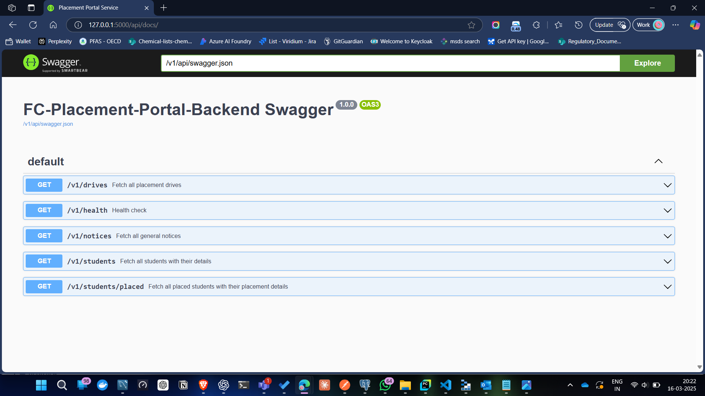

# FC Placement Portal Backend Setup (Version 1)

## Prerequisites
Before setting up the backend for the FC Placement Portal, make sure you have the following installed:

- Python 13.1 or higher
- MySQL with MySQL Workbench
- Git

## Setup Instructions

### Step 1: Clone the Git Repository
Clone the repository to your local machine:

```bash
git clone https://github.com/shireen-vir/FC-Placement-Portal
```

### Step 2: Install Dependencies
Navigate to the project directory and install the required dependencies from the `requirements.txt` file:

```bash
cd FC-Placement-Portal
pip install -r requirements.txt
```

### Step 3: Create a `.env` File
Create a `.env` file in the root of the project directory. This file will contain your MySQL local host credentials.

Add the following variables to the `.env` file:

```env
DB_HOST=your_mysql_host
DB_USER=your_mysql_user
DB_PASSWORD=your_mysql_password
DB_NAME=your_mysql_database
```

Make sure to replace the values with your actual MySQL credentials.

### Step 4: Set Up MySQL Database

1. Navigate to `resources/mysql_database_setup_v1.sql`.
2. Open the `.sql` file in MySQL Workbench or your local MySQL instance.
3. Run the script to create the required database and tables.

Additionally, navigate to `resources/mysql_database_setup_v1.mwb` to open the MySQL Workbench model, which includes the ER diagram and other model requirements. You can use this `.mwb` file in MySQL Workbench to visualize and manage the database schema.

### Step 5: Populate Database with Dummy Data

1. Navigate to `local_scripts/local_mysql_database_setup_v1.py`.
2. Run the script to populate your local database with dummy data from the file: `resources/students_data_v1.xlsx`.

After running the script, you'll see the following message on the console:

```
Data inserted successfully!
```

### Step 6: Add Additional Data for Testing (Optional)

If you want to add some more data for testing purposes, run the script `resources/placement_portal_populate_script_v1.sql`. This script contains all the data you'll need for testing the backend and required filters.

### Step 7: Clearing Database Tables (Use Cautiously)

If you need to clear the contents of all the database tables, you can use the script provided in the `resources/truncate_all_tables.sql`. **Use this file with caution**, as it will delete all data from the tables.

### Step 8: Dropping and Recreating the Database (If Needed)

If you wish to delete the database and start from scratch, run the following command in MySQL:

```sql
DROP DATABASE {name of database};
```

After this, you can re-run the setup steps starting from creating the database and tables.

### Step 9: Local Version 1 Setup Complete
Your local setup for version 1 of the FC Placement Portal is now ready.

### Step 10: Create a New Branch for Development
Create a new branch from `main` to begin working on your development, fixes, or improvements:

```bash
git checkout -b your-feature-branch
```

### Step 11: Push Changes and Raise a PR
Once you've made your changes, push the branch to the remote repository:

```bash
git push origin your-feature-branch
```

Then, raise a Pull Request (PR) to merge your changes with the deployed backend. Collaborate with other developers to review and approve the PR before merging.

### Step 12: Run the Service Locally and Test APIs

Once the above steps are completed, you're ready to run the service locally.

1. Set the `FLASK_APP` environment variable and start the Flask server:

```bash
$env:FLASK_APP="app.py"
flask run
```

2. You'll see messages like the following on the console, which means the service has started successfully:

```
2025-03-16 17:55:18,221 - app - INFO - Initialize Flask
2025-03-16 17:55:18,222 - app - INFO - Initialize APISpec
2025-03-16 17:55:18,223 - app - INFO - Register Blueprint - Sample Blueprint Registration
2025-03-16 17:55:18,223 - app - INFO - Register Blueprint - Global Routes
2025-03-16 17:55:18,224 - app - INFO - Register Blueprint - Dashboard Service Routes (Students API)
2025-03-16 17:55:18,227 - app - INFO - Register Blueprint - Swagger UI
 * Serving Flask app 'app.py'
 * Debug mode: off
WARNING: This is a development server. Do not use it in a production deployment. Use a production WSGI server instead.
 * Running on http://127.0.0.1:5000
Press CTRL+C to quit.
```

3. You can navigate to the following URL to access the API documentation and test the APIs:

```
http://127.0.0.1:5000/api/docs/
```


Alternatively, you can use Postman to test the APIs.

---

## Happy Development! 🎉
